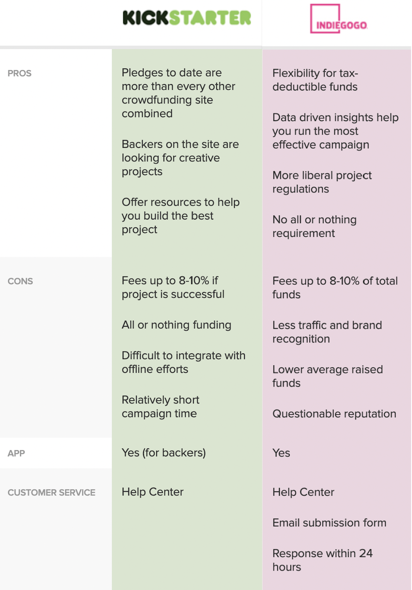

# Set-up {-}

```{r load packages, message=FALSE, warning=FALSE}
# Install "fastDummies" package to quickly create dummy variables (UN-COMMENT THE CODE TO DOWNLOAD THEN COMMENT AGAIN ONCE DOWNLOADED SO IT DOESN'T RUN AGAIN)
#install.packages('fastDummies')

# package that share common data representations and 'API' design
library(tidyverse)
# package to create visualizations
library(ggplot2)
# package called "broom" that converts statistical objects into Tiny Tibbles
library(broom)
# package called "fastDummies" is used to create the dummy variables all at once, saving time. We just select the Dummy variables that we need.
library('fastDummies')
```

# Abstract

As part of the Data Analytics: R class, teams were tasked with identifying a business need and creating an analysis to try to solve the business need.

The data that was chosen by our team is based on the success rate on projects that are uploaded to Indiegogo, an online platform that serves as a crowd funding for projects, products and services.

## Topic

Success rate of Indiegogo campaigns categories in the last 10 years.

## Introduction

When it comes to crowd funding websites, we have always heard about Kickstarter and Indiegogo. [Grasshopper Resources](https://grasshopper.com/resources/tools/crowdfunding-platforms-kickstarter-gofundme-indiegogo/) shares a great 3-way comparison between Kickstarter, GoFundMe and Indiegogo. For this case, we will be taking only Kickstarter and Indiegogo into consideration. The article shares a snapshot the pros and cons for both platforms, see below:

<br /> 
<center>
{width=50%}
</center>
<br /> 

[Funded Today](https://www.funded.today/blog/kickstarter-vs-indiegogo-which-is-better) is an article that sides Kickstarter since the very beginning but mentioned about some of the advantages of Kickstarter including exceptional customer service and allow pre-prototype launch. These are two great attributes to have for students since we are still a beginner and just need to put our foot in the door. We also wanted to choose the underdog in this case and learn more about its campaigns, categories, amount funded, and percentage funded.

## Objectives

We want to find out if Indiegogo campaigns in a specific category have different success rate compared to other categories. As business analytics students and aspiring entrepreneurs, we want learn more about what categories on the platform have the highest success rates, most amount of money raised, and the average duration of campaign length. These things will allow us to gear our future projects into this direction to guarantee whether or not our projects will be successful on this platform. This analysis will cover all of these elements to allow us and our fellow classmates to make an informed decision on whether or not to use Indiegogo to crowd fund our future projects.

<u>Hypothesis:</u>

H0 = Indiegogo campaigns have the same success rate compared to other categories on the platform

H1 = Indiegogo campaigns have different success rates compared to other categories on the platform

## Plan

1) We will check the success rate of the campaigns over the last few years to check if the chances of fully fund a project have been the same or have increased/decreased. 

2) We will be finding out the amount of successful projects per category and how they rank with other categories

3) We will be creating box plot, histograms, scatter plots, and bar graphs to visualize our analysis.

4) We will create an analysis based on the top five categories and will try to explain why they are the leading categories compared to the ones that aren't.

# Data 

## Background

1) This data set was obtained from an online scraper that scraped Indiegogo's campaigns for the last few years. We will be only using this year's data that is a snapshot of the last 10 years as there are several campaigns ```open_date``` from 2010.

2) The data set source is [hyper-linked](https://webrobots.io/indiegogo-dataset/). We individually downloaded the ```csv``` files from each months in 2020.

## Data Cleaning

There were multiple ```csv``` files per month and we obtained the last 11 months of snapshots for the past decade worth of data. This made data loading difficult. We were able to collectively import all data sets and merge it into one data set.

```{r load data, message=FALSE, warning=FALSE, include=FALSE}
# import data and combining it into one file - master_file
myfiles <- 
  list.files(path = "./Datasets/",
             pattern = "csv", full.names = TRUE)
  list_files<-lapply(myfiles,function(x) read_csv(x))
  master_file<-do.call(rbind,list_files)
```

Just to double-check if our file is running correctly, we can run a summary and check its length, class, and mode. For the numeric values, we can see its basic descriptive statistics.

```{r summary}
# data summary
summary(master_file)
```

Number of columns and rows:

```{r number of columns and rows}
# number of observations (rows)
nrow(master_file)

# number of variables (columns)
ncol(master_file)
```

First five rows:

```{r first five rows}
# first five rows
master_file %>% slice_head(n=5)
```

### Removing duplicates

This is currently a still dirty data set meaning it needs to be cleaned. We will be cleaning in several ways. The first one is to remove duplicate observations.


```{r remove duplicates}
# remove duplicates based on project_id
indiegogo <- master_file %>% distinct(project_id, .keep_all = TRUE)
```

We just removed all duplicates by ```project_id``` so we now have an individual ```project_id``` per campaign in the clean data set. 

```{r number of rows}
# number of rows (observations)
nrow(indiegogo)
```

There were 708648 observations in the dirty ```master_file```, and now there are 42902 observations the new data set ```indiegogo```. It is a huge decrease, but exactly how much?

```{r row change}
# row change
nrow(master_file)/nrow(indiegogo)
```

The new data set was cut by more than 16 times! That means that, on average, there were 16 or 17 duplicates per campaign.

### Dropping columns

The next cleaning step is to remove columns that are not needed and won't be taken into consideration for the analysis.


```{r drop columns}
# drop unneeded columns
indiegogo <- indiegogo[, !names(indiegogo) %in% c("bullet_point","category_url",
                                             "source_url","image_url",
                                             "offered_by","perk_goal_percentage",
                                             "perks_claimed","price_offered",
                                             "price_retail","project_type",
                                             "tagline", "is_indemand",
                                             "is_pre_launch", "product_stage", "tags")]
```

We dropped 15 variables (columns) and see that the new data set now only has 9 variables (columns). This definitely cleaned up the data set to our liking, but we're not done yet.

### Filling NAs

We will also be filling values with ```NA``` if they are null.

```{r fill NA}
# replace all values containing "null" to actual null value
is.na(indiegogo) <- indiegogo == "null"
```

Now all values that were entered as "null" has been nullified.

### Removing unwanted NA values

We looked closer into the data set and found out that some of the ```open_date```, ```close_date``` and ```title``` were ```null```. In these cases, we plan to remove them from the data maintain a clean data set

```{r remove some NA values}
# removing rows where there is a null value in the selected columns
indiegogo <- indiegogo[complete.cases(indiegogo[, c("open_date",
                                                    "title",
                                                    "close_date")]), ]
```

We see that a little over 400 observations were removed and we are left with 42492 observations (rows) and 11 variables (columns)

### Removing dates that does not match / open projects

Something we noticed was that some of the dates ```open_date``` and ```close_date``` had a different format. In these cases, we plan to remove them from the data maintain a clean data set so we can make calculations in the future. Another aspect we wanted to check is that open projects might skew the information because they are increasing its funding each day that passes, so we took the decision to remove them to get and "static" view.

```{r remove mismatched dates}
#filtering out invalid dates in the close and open date
indiegogo <- subset(indiegogo, nchar(as.character(close_date)) == 25)
indiegogo <- subset(indiegogo, nchar(as.character(open_date)) == 25)
```

After this our 'final' dataset contains 40,039 rows and is ready for us to start working on it.

### Mutuating and creating new columns

Now we will create some extra columns that will aid us with the project and that we will use in future stages of the project.

```{r added column names}
# We will add 9 columns that we are going to use later on.
indiegogo <- 
  indiegogo %>% 
  mutate(open_date = strtrim(open_date, 10),
         close_date = strtrim(close_date, 10), 
         year_close = substr(close_date, 1, 4),
         year_open = substr(open_date, 1, 4),
         date_diff = as.double(as.Date(as.character(indiegogo$close_date), format="%Y-%m-%d")-
                                 as.Date(as.character(indiegogo$open_date), format="%Y-%m-%d")),
         funds_raised_100_percent = round(funds_raised_percent * 100, digits = 2),
         goal_achieved = ifelse(funds_raised_100_percent >= 100,1,0),
         log_percent = log(funds_raised_100_percent),
         funds_dollars = 
            ifelse(currency == "AUD",funds_raised_amount/1.31,
            ifelse(currency == "CAD",funds_raised_amount/1.28,
            ifelse(currency == "CHF",funds_raised_amount/0.88,
            ifelse(currency == "DKK",funds_raised_amount/6.07,
            ifelse(currency == "EUR",funds_raised_amount/0.82,
            ifelse(currency == "GBP",funds_raised_amount/0.74,
            ifelse(currency == "HKD",funds_raised_amount/7.75,
            ifelse(currency == "NOK",funds_raised_amount/8.59,
            ifelse(currency == "SEK",funds_raised_amount/8.24,
            ifelse(currency == "SGD",funds_raised_amount/1.33,
            funds_raised_amount)))))))))),
         log_amount = log(funds_dollars))

```

## Key Variables

We just cleaned the data set and are left with 11 variables (column) which are:

```{r column names}
colnames(indiegogo)
```

Each of this has their own significance in the analysis.

```category``` -> Campaign category (our main independent variable), it refers to the segment that the project is aimed at.

```clickthrough_url``` -> Campaign URL on Indiegogo's website.

```close_date``` -> Campaign end date (used to find out how long the campaign was going on for).

```currency``` -> Currency in which the campaign was funded (we need it to convert to dollars).

```funds_raised_amount``` -> The amount of funds the campaign raised over its duration on the website.

```funds_raised_percent``` -> The campaign's percentage of completion; if it is ```1``` or higher, the campaign has been successful because it has raised as much as they initially asked for (our main dependent variable) .

```open_date``` -> Campaign start date (used to compare with ```close_date``` to find out the duration of the campaign).

```project_id``` -> Unique campaign ID (primary key).

```title``` -> Campaign title as published on the Indiegogo website.

```year_close``` -> An extraction of the year from ```close_date```.

```year_open``` -> An extraction of the year from ```open_date```.

```date_diff``` -> A calculation to get the campaign duration, from ```open_date``` to ```close_date```.

```funds_raised_100_percent``` -> We formatted the column ```funds_raised_percent``` by multiplying it by 100, that way we can see the percentages as whole numbers instead of decimals.

```goal_achieved``` -> A flag of 0 or 1, if the project achieved 100% or more in the column  ```funds_raised_100_percent```, it will receive a 1 else, it will have a 0.

```log_percent``` -> A mutation to the ```funds_raised_100_percent``` to log the number.

```funds_dollars``` -> A rate conversion from ```currency``` to dollars, that way the data is not thrown off by a stronger or weaker currency.

```log_amount``` -> A mutation to the ```funds_dollars``` to log the number.

# Exploratory data analysis

We aim for 7 plots/ that will allow us to have an initial insight of the data.

## Figure 1 - Histogram 1

This is a histogram shows the ```funds_raised_percent``` of the projects, as we can see, it's not very helpful, this is why on the second graph we use the log of the same column.

```{r funds_raised_percent histogram}
indiegogo %>% 
  ggplot(mapping = aes(funds_raised_percent)) +
  geom_histogram()
```

## Figure 2 - Histogram 1.2

By transforming the data, we can see the distribution of the ```funds_raised_percent``` in a much clearer way.

```{r log(funds_raised_percent) histogram}
indiegogo %>% 
  filter(funds_raised_percent > 0) %>% 
  ggplot(mapping = aes(log(funds_raised_percent))) +
  geom_histogram()
```
## Figure 3 - Bar Chart

With this graph we aim to check how may projects were launched by year.

```{r open projects Bar Chart}
# open projects Bar Chart
indiegogo %>% 
  group_by(year_open) %>% 
  summarise(count = length(year_open)) %>% 
  ggplot(aes(x = year_open, y = count)) +
  geom_col() +
  labs(y="Number of Projects", x="Year", 
       title = "Number of Projects Launched by Year", 
       fill = "")+
  theme(legend.position="top") +
  theme(plot.title = element_text(hjust = 0.5))
```

We can observe an increasing trend as the years go by, there is an abnormality with the year 2015 but the overall trend follows an increase in the project submitted to the page.

## Figure 4 - Line graph

This is a line graph of ```funds_raised_100_percent```. This was also part of our initial visualization to see the spread of our data.

```{r log(funds_raised_100_percent) line graph}
# log(funds_raised_100_percent) line graph
indiegogo %>% 
  filter(funds_raised_100_percent > 0) %>% 
  group_by(year_open) %>% 
  summarise(mean_success = mean(log_percent)) %>% 
  ggplot(aes(x = year_open, y = mean_success, group = 1)) +
  geom_line() +
  labs(y="Success of Projects (in %)", x="Year", 
       title = "Success of Projects by Year", 
       fill = "")+
  theme(legend.position="top") +
  theme(plot.title = element_text(hjust = 0.5))
```

<u> Why? </u>

These initial visualizations gave us an idea of how our data looks like. We can conclude that we have many outliers that are messing up the rest of the data. We will be looking into this deeper through the series of visualizations below.

## Figure 5 - Box plot

We decided to filter out ```funds_raised_percent``` to > 0 in order to make the ```log_percent``` work. This is the visualization outcome, in order of highest median. 

```{r funds_raised_percent vs category box plot v1}
# funds_raised_percent vs category box plot v1
indiegogo %>% 
  filter(funds_raised_100_percent > 0) %>%
  ggplot(aes(x=log_percent, y=reorder(category, log_percent, FUN = median, .desc =F))) +
  geom_boxplot() +
  labs(y="Category", x="Log Funds Raised (%)", 
       subtitle="Funds Raised vs Category Box Plot")

```
We can observe that Audio, Tabletop Games, Camera Gear, Home, and  Travel and Outdoors are out top performing categories, their median is higher than the other categories, so we start to see that the category has an effect on the success of the project. We can also observe that for out top categories, the first quartile is very long, this could mean that is difficult fore the projects to take off, and the third quartile is relatively short against the other ones, this supports the idea that once a project starts to get funding, is easier to continue raising funds.

## Figure 6 - Mean Plotting with filtered infomration

Creating a new data frame with only the mean values of the top five most successful categories:

```{r mean_indiegogo}
# mean of successful funds percent raised per category
mean_indiegogo <- indiegogo %>% 
  group_by(category) %>% 
  summarise(mean_percent = (mean(goal_achieved)*100)) %>% 
  slice_max(mean_percent, n=5)
#mean_indiegogo

# reorder categories in a descending fashion
mean_indiegogo$category <- with(mean_indiegogo, reorder(category, -mean_percent))
mean_indiegogo

# Top 5 - Mean & Median Success Rate (%) per Category bar graph
mean_indiegogo %>% 
  ggplot(aes(x=category, y=mean_percent, fill = "blue"))+#, color = variable)) +
  geom_bar(stat="identity", position ="identity", alpha = 0.5) +
  scale_color_manual(values=c("blue"), guide = FALSE) +
  scale_fill_manual(labels = c("Mean"), values=c("blue")) +
  geom_hline(yintercept = 50, color = "black") +
  labs(x="Category", y="Success Rate (%)", 
       title = "Top 5 - Mean Success Rate (%) per Category", 
       fill = "")+
  theme(legend.position="top") +
  theme(plot.title = element_text(hjust = 0.5))
```

In this graph, we can observe that although projects seem to be very successful meaning that the success rate averages around 50%. We can observe that launching a project on any of these top five categories has a high probability of being successful, but further analysis is required to verify this claims.

## Figure 7 - Pareto Chart

Our final figure is a Pareto Chart, which is essentially a bar graph and a line graph (with cumulative values) in one, this shows the volume of the projects depending on the duration of the project and what percent it is from all the projects. This makes it easier to understand were the bulk of the information is located.

```{r Pareto Chart}
pareto_indiegogo <- 
  indiegogo %>% 
  group_by(date_diff) %>% 
  summarise(count = length(date_diff), .groups = 'drop') %>% 
  arrange(desc(count)) %>% 
  mutate(., cumulative_ = cumsum(count),
            cumulative = (cumulative_ / tail(cumulative_, n=1))*100)

scaleRight = tail(pareto_indiegogo$cumulative, n=1)/head(pareto_indiegogo$count, n=1)

pareto_indiegogo %>% 
  slice_head(n=15) %>% 
  ggplot( aes(x=reorder(date_diff,-count))) +
  geom_bar(aes(y=count), fill='deepskyblue4', stat="identity") +
  geom_path(aes(y=cumulative/scaleRight, group=1),colour="red", size=0.9) +
  geom_point(aes(y=cumulative/scaleRight, group=1),colour="red") +
  scale_y_continuous(sec.axis = sec_axis(~.*scaleRight, name = "Cumulative (%)")) +
  theme(axis.text.x = element_text(angle=90, vjust=0.6)) +
  labs(title="Pareto Chart", subtitle="Projects by Duration", x="Background Source", y="Num of Projects by Duration")
```

After playing with the data and doing some research, we came upon that the standard predefined project length by Indiegogo is 60 days, this means that if the person responsible of submitting the project fails to set a specific length, Indiegogo will set the duration to 60 days. This translates to 70% of the campaigns are located in just 5 chosen project lengths (60, 30, 45, 1, 40 days).

Now, what about outliers? 
Indiegogo can allow the owner of the project to extend the length of the campaign, but how much? Well, we have projects that surpass the 700 day mark, of course they are outliers but as we can see, increasing the length of the campaign does not mean that the project will reach it desired goal. In the other graphs, we saw data that was way off, this could mean that a specific project, had a lot of attention and raised a lot of money, possibly skewing the data.

# Analysis plan

Based on the graphs that we have presented, we can clearly see the the success of the project is dependent on the category that the project is targeted to. We can also notice how the top performing categories have a closer difference between them than the lower performing categories.

In a later stage, we want to have a deep dive into how the outcome if the project is affected by the category selected vs the other ones. In order to achieve this, we will be using dummy variables, by doing so, we can isolate data and view it in a more comprehensive way.

In order for us to prove or reject the null hypothesis, we will run different correlations and to determine if there is a significance in the data or not.

# Issues

1) We are unsure that we have all the projects that have been launched in the platform since the beginning of our data, this would mean that we might be missing some helpful insights from those projects. 

2) We don't know if the scraping was correctly done, if the data did not meet our criteria (date formats and NA values), the rows were dropped, so we might have a much more smaller database from the one we started. We would have wanted to have an updated date column so we could track the progress of the different projects, this could have enabled us to offer a deeper dive on the performance of the projects. 

3) We are unsure about the outcome of the project but we will overcome it by working on the project.

# Modifying the Initial Hypothesys

After the initial analysis, we decide we wanted to have a deeper dive into the duration of the projects, the top 5 categories and the amount that needs to be asked to have a successful campaign.

H0 = The duration of the Indiegogo campaigns is not related to the success rate.
H0 = There is no difference on the amount needed on the Indiegogo campaigns to make it successful.
H0 = The top five performing Indiegogo categories have the same opportunities on being successful.

H1 = The duration of the Indiegogo campaigns is related to the success rate.
H1 = There is a difference on the amount needed on the Indiegogo campaigns to make it successful.
H1 = The top five performing Indiegogo categories does not have the same opportunities on being successful.

# Checkpoint #2

## Overlapping the Top 5 Categories with the log_percent

We want to compare how the top 5 categories perform regarding the distribution of the ```log_percent```. 

```{r overlap log_percent}
indiegogo %>% 
  filter(category %in% c("Audio", "Tabletop Games", "Home", "Camera Gear", "Travel & Outdoors")) %>%
  filter(funds_raised_100_percent > 0) %>% 
  ggplot(aes(x = log_percent)) + 
  geom_density(aes(colour = category)) +
  labs(x="Success Percent", y="Density", 
       title = "Success Rate by Category Distribution", 
       fill = "")+
  theme(legend.position="top") +
  theme(plot.title = element_text(hjust = 0.5))
```
We can observe that the length of the bell is very similar between the categories as well as the shape, the density is what is changing and is understandable since we don't have the same amount of projects for each category.

## Overlapping the Top 5 Categories with the log_amount

We want to see not how the log amount react.

```{r overlap log_amount}
indiegogo %>% 
  filter(category %in% c("Audio", "Tabletop Games", "Home", "Camera Gear", "Travel & Outdoors")) %>%
  filter(funds_raised_amount > 0) %>% 
  ggplot(aes(x = log_amount)) + 
  geom_density(aes(colour = category)) +
  labs(x="Success in Dollars", y="Density", 
       title = "Success in Dollars by Category Distribution", 
       fill = "")+
  theme(legend.position="top") +
  theme(plot.title = element_text(hjust = 0.5))
```
We can see that all of our top performing categories are bimodal, in fact, most of the other "not top performing" categories are unimodal. We are going to do some regressions to try to get to the buttom of this behavior.


## Regression

### Success Rate

Since our independent variable is a categorical variable, we will have to create dummy variables for each of them to run a successful regression model. We will be using the ```fastDummies``` libary to help us quickly do that automatically. The dummy dataframe has been named ```indiegogo_dummy``` and will be used to do regressions.

```{r dummy}
indiegogo_dummy <- dummy_cols(indiegogo, select_columns = 'category')
```

The first regression we are running is the ```log_percent``` versus all of our ````category``` to see if they are significant values.

```{r log_percent vs all dummy categories}
# Project_success vs all dummy categories
indiegogo_dummy %>% 
  # The reason why we have to filter for funds_raised_100_percent > 0 is because if    funds_raised_100_percent == 0, the log_percent will be NA and will produce an error
  filter(funds_raised_100_percent > 0) %>% 
  lm(formula = log_percent ~
       category_Art + 
       category_Audio +
       `category_Camera Gear`+ 
       category_Comics +
       category_Culture + 
       `category_Dance & Theater`+
       category_Education +
       `category_Energy & Green Tech` +
       category_Environment + 
       `category_Fashion & Wearables` +
       category_Film +
       `category_Food & Beverages` + 
       `category_Health & Fitness`+
       category_Home +
       `category_Human Rights` + 
       `category_Local Businesses` +
       category_Music +
       `category_Phones & Accessories`+
       category_Photography +
       `category_Podcasts, Blogs & Vlogs` +
       category_Productivity +
       `category_Tabletop Games` +
       category_Transportation +
       `category_Travel & Outdoors` +
       `category_Video Games` +
       `category_Web Series & TV Shows`+
       category_Wellness +
       `category_Writing & Publishing`,
     data = .) %>% 
  summary()
```

We can see that almost all of our categories are significant values as the p-value is less than 0.05. More importantly, our top five categories as mentioned in the initial analysis are all significant as well. The next following regressions will focus on them to understand their success rates.


```{r top 5 multiple regression}
#top 5 multiple regression
indiegogo_dummy %>% 
  filter(funds_raised_100_percent > 0) %>% 
  lm(formula = log_percent ~
       category_Audio + 
       `category_Tabletop Games` +
       `category_Camera Gear` +
       `category_Travel & Outdoors` +
       category_Home, 
     data = .) %>% 
  summary()
```

On this regression, we can see that the our top 5 categories have a positive value, meaning it is performing above the average and have the highest success rates.

### Campaign duration

The next regression is log_percent ~ date_diff. Here we want to see if there is a relation between how successful your project is and if the campaign duration is relevant.

```{r log_percent ~ date_diff}
indiegogo %>% 
  filter(funds_raised_100_percent > 0) %>% 
  lm(formula = log_percent ~ date_diff,
     data = .)%>% 
  summary()
```

We can see that both values are significant and thus have a correlation. In this case, we see a negative correlation which means that the shorter amount of time you have your campaign duration, the more successful it will be. 


```{r date_diff ~ top 5 categories}
indiegogo_dummy %>% 
  lm(formula = date_diff ~ 
       category_Audio + 
       `category_Tabletop Games` +
       `category_Travel & Outdoors` +
       `category_Camera Gear` +
       category_Home, 
     data = .)%>% 
  summary()
```

We create a regression with date_diff with our top five categories and see that all values are significant. Check out the figure below to show it with values filled in.

```{r date_diff ~ log_percent scatter plot}
indiegogo %>% 
  filter(funds_raised_100_percent > 0,
         date_diff <= 120,
         category %in% c("Audio", "Tabletop Games","Travel & Outdoors", "Camera Gear", "Home")) %>% 
  ggplot(mapping = aes(log_percent, date_diff)) +
  geom_point() +
  geom_smooth(method = "lm") +
  #ylim(0,120)+
  #xlim(-5,10) +
  geom_hline(yintercept = 60, color = "red") +
  #geom_vline(xintercept = 45, color = "red") +
  geom_hline(yintercept = 30, color = "red") +
  geom_vline(xintercept = -3.5, color = "red") +
  geom_vline(xintercept = 4.6, color = "red")
```

```{r exp}
# log_percent value when date_diff = 60
exp(-3.5)

# log_percent value when date_diff = 30
exp(4.6)
```

The model shows is that longer your campaign goes for, the less successful it will be. The output we see if date_diff = 60, is a 3% success rate, while, if date_diff = 30, the success rate is 99.5%. Obviously, this is the model, and it is not the most accurate, but the general idea is to keep your campaign in the 30-day range to stay relevant.

### Goal Achieved

The next model is goal_achieved and the top 5 categories. The goal_achived variable determines whether or not a project reached their goal. 

```{r goal_achieved ~ top 5 categories}
indiegogo_dummy %>% 
  lm(formula = goal_achieved ~ 
       category_Audio + 
       `category_Tabletop Games` +
       `category_Travel & Outdoors` +
       `category_Camera Gear` +
       category_Home, 
     data = .)%>% 
  summary()
```

Here as well, we can see a significant relation amongst all of our categories. A cool finding was that the value is actually the mean of the success_rate, which we found on Figure 6.

### Log_amount

The final regression is the log_amount and goal_achived.

```{r log_amount ~ goal_achieved}
indiegogo %>% 
  filter(funds_dollars > 0) %>% 
  lm(formula = log_amount ~ goal_achieved,
     data = .)%>% 
  summary()
```

We continue to see the values as signficant when compared to log_amount. But the main question is - what is the exact amount needed on average to be a successful project in these categories?

```{r log_amount ~ top 5 categories}
indiegogo_dummy %>% 
  filter(funds_dollars > 0) %>% 
  filter(goal_achieved == 1) %>% 
  lm(formula = log_amount ~ 
        category_Audio + 
       `category_Tabletop Games` +
       `category_Travel & Outdoors` +
       `category_Camera Gear` +
       category_Home,
     data = .) %>% 
  summary()
```

The code below shows us the average amount needed to reach success in each category (in $).

```{r final}
audio_amount = round(exp(9.97353+1.26918), digits = 2)
print(paste("Audio: ", audio_amount), quote = FALSE)

tabletop_amount = round(exp(9.97353-0.55734), digits = 2)
print(paste("Tabletop Games: ", tabletop_amount), quote = FALSE)

travel_amount = round(exp(9.97353+1.40227), digits = 2)
print(paste("Travel & Outdoors: ", travel_amount), quote = FALSE)

camera_amount = round(exp(9.97353+1.18342), digits = 2)
print(paste("Camera Gear: ", camera_amount), quote = FALSE)

home_amount =  round(exp(9.97353+1.59241), digits = 2)
print(paste("Home: ", home_amount), quote = FALSE)

```